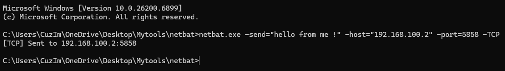
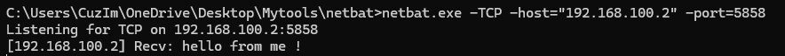

<h2>Connectivity testing utility made for windows ! </h2>
<h2>Usage</h2>
<ul>
<li>Creates a quick listener for UDP or TCP </li>
<li>Sends a quick TCP or UDP packets with auto buffering </li>
</ul>

<h2>Screenshots</h2>
<h2>TCP Listener and Sending</h2>

